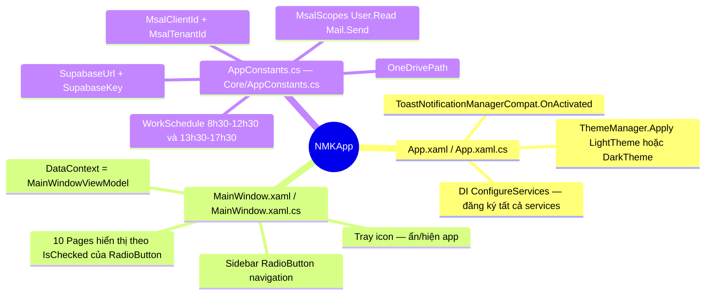
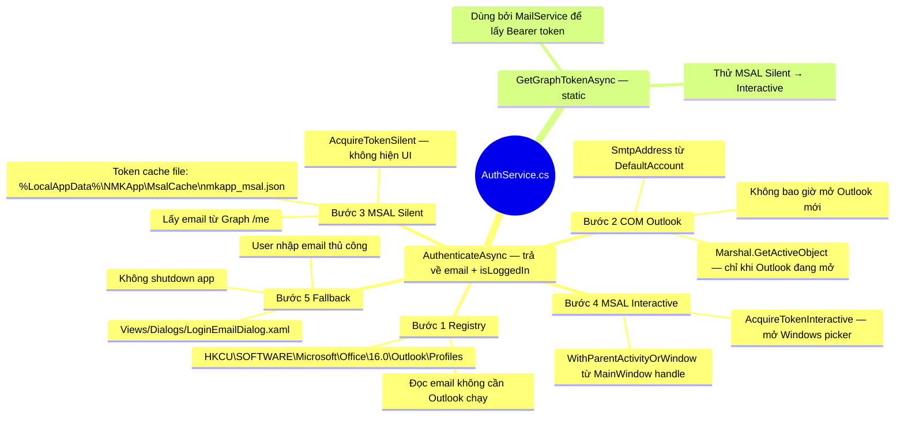
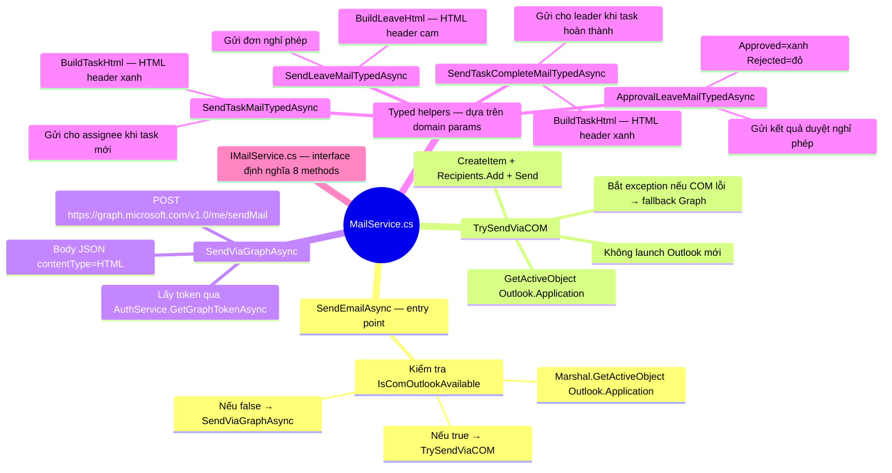
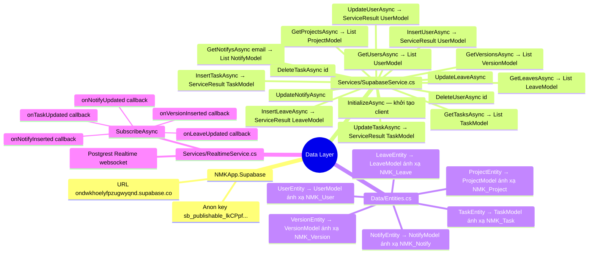
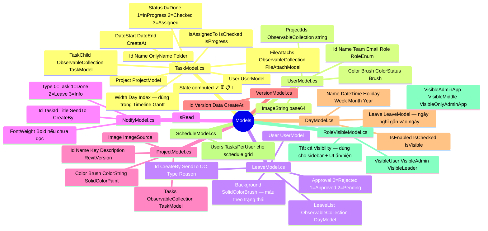
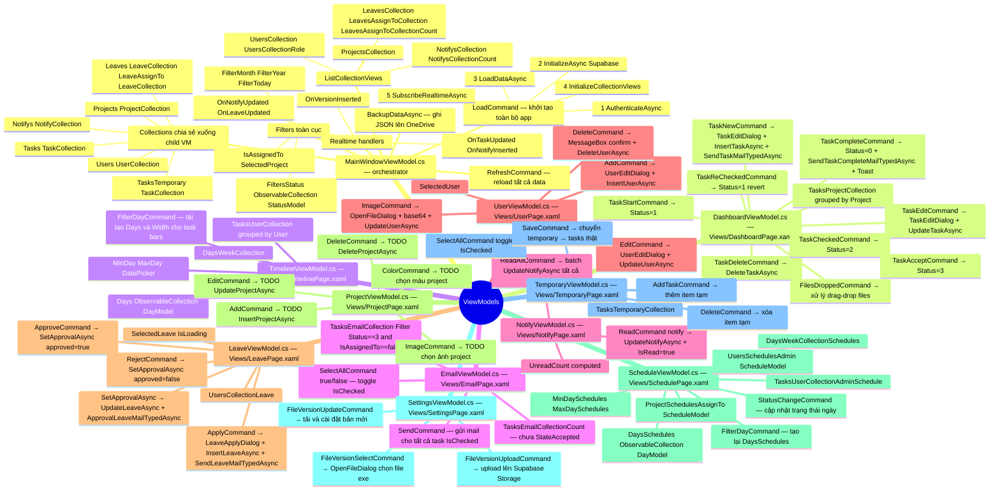
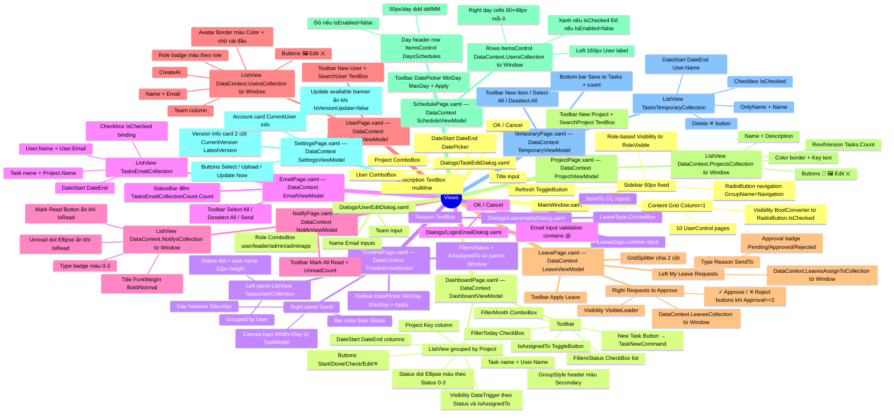
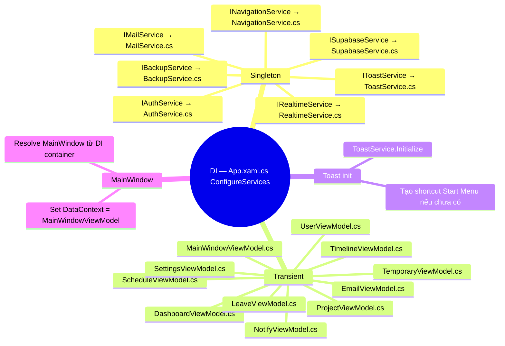
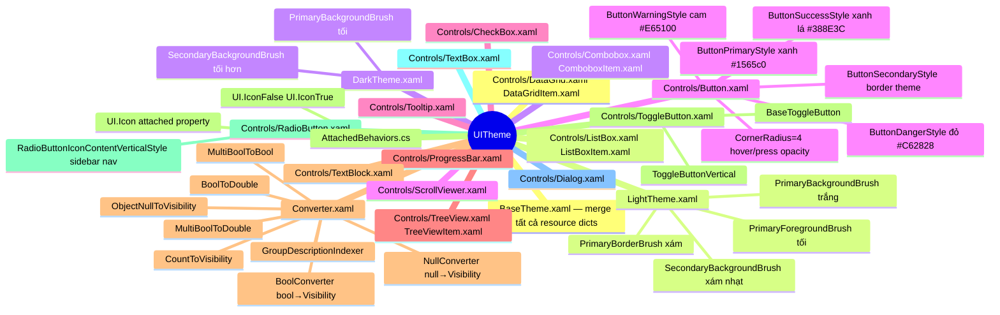

# NMKApp — Architecture Mind Map

> Sơ đồ tư duy toàn bộ logic ứng dụng. Mỗi nút ghi kèm tên file để dễ tìm kiếm.

---

## 1. Toàn cảnh (Overview Mindmap)



---

## 2. Auth Flow — Services/AuthService.cs



---

## 3. Mail Flow — Services/MailService.cs



---

## 4. Data Layer — Services/SupabaseService.cs + Data/Entities.cs



---

## 5. Models — Models/*.cs



---

## 6. ViewModels — ViewModels/*.cs



---

## 7. Views — Views/*.xaml



---

## 8. Services & DI — App.xaml.cs



---

## 9. UITheme — UITheme/*.xaml



---

## 10. Auth Decision Tree (text diagram)

```
Khởi động app
     │
     ▼ AuthService.AuthenticateAsync()
┌─────────────────────────────┐
│  Bước 1: Windows Registry   │ ──▶ tìm Outlook Profiles email
│  HKCU\Office\16.0\Outlook   │
└──────────────┬──────────────┘
               │ Không tìm thấy?
               ▼
┌─────────────────────────────┐
│  Bước 2: COM Outlook        │ ──▶ GetActiveObject (chỉ nếu đang chạy)
│  Marshal.GetActiveObject    │
└──────────────┬──────────────┘
               │ Không chạy?
               ▼
┌─────────────────────────────┐
│  Bước 3: MSAL Silent        │ ──▶ Token từ cache file JSON
│  AcquireTokenSilent         │     → GET /me → lấy email
└──────────────┬──────────────┘
               │ Không có cache?
               ▼
┌─────────────────────────────┐
│  Bước 4: MSAL Interactive   │ ──▶ Windows account picker
│  AcquireTokenInteractive    │     User chọn account
└──────────────┬──────────────┘
               │ User bỏ qua / lỗi?
               ▼
┌─────────────────────────────┐
│  Bước 5: LoginEmailDialog   │ ──▶ User nhập email thủ công
│  Views/Dialogs/...xaml      │     Validate @
└──────────────┬──────────────┘
               │ User cancel?
               ▼
        Application.Shutdown()
```

---

## 11. Mail Routing (text diagram)

```
MailService.SendEmailAsync(to, subject, html)
     │
     ├─ IsComOutlookAvailable?
     │   Marshal.GetActiveObject("Outlook.Application")
     │   │
     │   ├─ YES ──▶ TrySendViaCOM()
     │   │           CreateItem(0) + Recipients.Add(to)
     │   │           + HTMLBody = html + Send()
     │   │           Không cần token, không mở Outlook mới
     │   │
     │   └─ NO ──▶ GetGraphTokenAsync()
     │               MSAL silent → AcquireTokenInteractive
     │               │
     │               ├─ OK ──▶ POST graph.microsoft.com/v1.0/me/sendMail
     │               │          Authorization: Bearer {token}
     │               │          Body: { message: { toRecipients, subject,
     │               │                   body: { contentType: "HTML", content } } }
     │               │
     │               └─ Fail ──▶ Debug.WriteLine (bỏ qua nhẹ nhàng)
```

---

## 12. Realtime Flow — Services/RealtimeService.cs

```
Supabase Realtime WebSocket
     │
     ├─ Table: NMK_Task (UPDATE)
     │   → onTaskUpdated(TaskModel)
     │   → MainWindowViewModel.OnTaskUpdated
     │   → RefreshAllViews()
     │
     ├─ Table: NMK_Notify (INSERT)
     │   → onNotifyInserted(NotifyModel)
     │   → kiểm tra SendTo == CurrentUser.Email
     │   → Notifys.Items.Add + RefreshAllViews
     │   → ToastService.ShowNewNotification
     │
     ├─ Table: NMK_Notify (UPDATE)
     │   → onNotifyUpdated(NotifyModel)
     │   → cập nhật IsRead của existing notify
     │
     ├─ Table: NMK_Leave (UPDATE)
     │   → onLeaveUpdated(LeaveModel)
     │   → RefreshAllViews
     │
     └─ Table: NMK_Version (INSERT)
         → onVersionInserted(VersionModel)
         → DialogMessage hiển thị "New Version Available"
```


    Auth Flow
      AuthService.cs
        1 Registry
          HKCU Office 16 Outlook Profiles
        2 COM Outlook
          GetActiveObject
          Only if already running
        3 MSAL Silent
          Token cache disk
          AcquireTokenSilent
        4 MSAL Interactive
          WithParentActivityOrWindow
          Windows account picker
        5 Fallback dialog
          LoginEmailDialog.xaml

    Data Layer
      Supabase
        NMKApp.Supabase v1.1.1
        URL ondwkhoelyfpzugwyqnd.supabase.co
        Tables
          NMK_Version
          NMK_User
          NMK_Task
          NMK_Project
          NMK_Notify
          NMK_Leave
          NMK_Task_Backup
      SupabaseService.cs
        InitializeAsync
        CRUD per entity
        GetTasksByIdAsync
      RealtimeService.cs
        SubscribeAsync
        onTaskUpdated
        onNotifyInserted
        onLeaveUpdated
        onVersionInserted

    Mail
      MailService.cs
        IsOutlookAvailable COM
        Route COM first
        Fallback Graph API
        COM via GetActiveObject
        Graph via sendMail endpoint
        HTML builders
          BuildTaskHtml
          BuildLeaveHtml
      IMailService.cs
        SendTaskMailAsync raw
        SendTaskMailTypedAsync domain
        SendLeaveMailAsync raw
        SendLeaveMailTypedAsync domain
        ApprovalLeaveMailTypedAsync
      AuthService.GetGraphTokenAsync
        Provides Bearer token

    ViewModels
      MainWindowViewModel
        LoadCommand
          Authenticate
          InitializeAsync Supabase
          LoadDataAsync
          InitializeCollectionViews
          SubscribeRealtime
        BackupDataAsync
        RefreshCommand
        Child VMs
          DashboardVM
          TimelineVM
          EmailVM
          UserVM
          ProjectVM
          NotifyVM
          LeaveVM
          ScheduleVM
          SettingsVM
          TemporaryVM
        Collections
          Users UserModel
          Projects ProjectModel
          Tasks TaskModel
          Notifys NotifyModel
          Leaves LeaveModel
        Filters
          FilterMonth FilterYear
          FilterToday
          IsAssignedTo
          SelectedProject
          FiltersStatus

      DashboardViewModel
        TasksProjectCollection
          Grouped by Project
          Filtered by status month today
        TaskNewCommand
        TaskEditCommand
        TaskDeleteCommand
        TaskCompleteCommand status 0
        TaskStartCommand status 1
        TaskCheckedCommand status 2
        TaskReCheckedCommand revert to 1
        TaskAcceptCommand status 3
        FilesDroppedCommand

      LeaveViewModel
        ApplyCommand
          InsertLeaveAsync
          SendLeaveMailTypedAsync
        ApproveCommand
        RejectCommand
        ApprovalLeaveMailTypedAsync

      NotifyViewModel
        ReadCommand
        ReadAllCommand
        UpdateNotifyAsync mark read

      UserViewModel
        AddCommand
        EditCommand
        DeleteCommand
        ImageCommand base64

      EmailViewModel
        TasksEmailCollection
          Status 3 and not assignedTo
        SelectAllCommand
        SendCommand
          SendTaskMailTypedAsync

    Views
      MainWindow.xaml
        Sidebar RadioButton nav
        Role-based visibility
        Page Content Grid
        Taskbar overlay
      DashboardPage.xaml
        Toolbar filters
        ListView grouped by Project
        Per-task action buttons
          Start Done Check Edit Delete
        Status color indicator
      Dialogs
        TaskEditDialog new and edit
        UserEditDialog new and edit
        LeaveApplyDialog
        LoginEmailDialog fallback

    Models
      TaskModel
        Status 0 Complete 1 InProgress 2 Checked 3 Assigned
        IsAssignedTo
        FileAttachs
        TaskChild
      UserModel
        RoleEnum RoleType
        ImageString base64
      LeaveModel
        LeaveList ObservableCollection DayModel
        Approval 0 Rejected 1 Approved 2 Pending
      NotifyModel
        IsRead
        Type Status
      ProjectModel
        Key Color

    Services
      BackupService
        BackupAsync
        OneDrive path
        JSON files
      ToastService
        Initialize shortcut
        Show title message taskId
        ShowTaskComplete
        ShowNewNotification
      NavigationService
        Navigate CurrentPage
      ISupabaseService
        Full CRUD all entities

    UITheme
      BaseTheme.xaml merges Controls
      Controls
        Button.xaml Primary Secondary Success Danger Warning
        ToggleButton.xaml
        RadioButton.xaml nav sidebar
        Dialog.xaml templates
      LightTheme.xaml
      DarkTheme.xaml
      ThemeManager switch runtime
      Converters BoolConverter NullConverter etc

    Constants AppConstants.cs
      SupabaseUrl
      SupabaseKey
      MsalClientId 30a2d671
      MsalTenantId common
      MsalScopes User.Read Mail.Send
      Roles adminapp admin leader user
      WorkSchedule 8:30 12:30 13:30 17:30
      OneDrivePath
```

## Layer Map

```
┌────────────────────────────────────────────────┐
│                    Views (WPF)                  │
│  MainWindow · DashboardPage · 9 pages · Dialogs│
└────────────────┬───────────────────────────────┘
                 │ DataContext binding
┌────────────────▼───────────────────────────────┐
│               ViewModels (MVVM)                 │
│  MainWindowVM · DashboardVM · Email/Notify/...  │
└────────────────┬───────────────────────────────┘
                 │ DI injected
┌────────────────▼───────────────────────────────┐
│                Services (DI)                    │
│  AuthService · MailService · SupabaseService    │
│  ToastService · BackupService · RealtimeService │
└────────────────┬───────────────────────────────┘
                 │
┌────────────────▼───────────────────────────────┐
│          Data / External                         │
│  Supabase (PostgreSQL) · Microsoft Graph API    │
│  Windows Registry · COM Outlook · Toast WNS     │
└────────────────────────────────────────────────┘
```

## Auth Decision Tree

```
Start
  │
  ▼
Registry (HKCU\Office\16.0\Outlook\Profiles)
  │ found?
  ├─ YES ──► use email ──► LoadData
  │
  ▼ NO
COM Outlook (GetActiveObject — never launches new process)
  │ running + logged in?
  ├─ YES ──► use SmtpAddress ──► LoadData
  │
  ▼ NO
MSAL cached token (disk cache)
  │ cached account?
  ├─ YES ──► AcquireTokenSilent ──► fetch email via Graph ──► LoadData
  │
  ▼ NO
MSAL Interactive (Windows account picker)
  │ user selects account?
  ├─ YES ──► AcquireTokenInteractive ──► LoadData
  │
  ▼ NO
LoginEmailDialog (manual input)
  │ user enters email?
  ├─ YES ──► LoadData (limited — no mail sending)
  │
  ▼ NO
  Application.Shutdown()
```

## Mail Routing

```
sendMail(to, subject, htmlBody)
  │
  ├─ IsComOutlookAvailable?
  │   YES ──► GetActiveObject + CreateItem + Send (no auth needed)
  │
  └─ NO ──► GetGraphTokenAsync (MSAL silent)
              │
              ├─ token? ──► POST /me/sendMail (Graph API)
              │
              └─ no token ──► Debug.WriteLine (skip silently)
```
